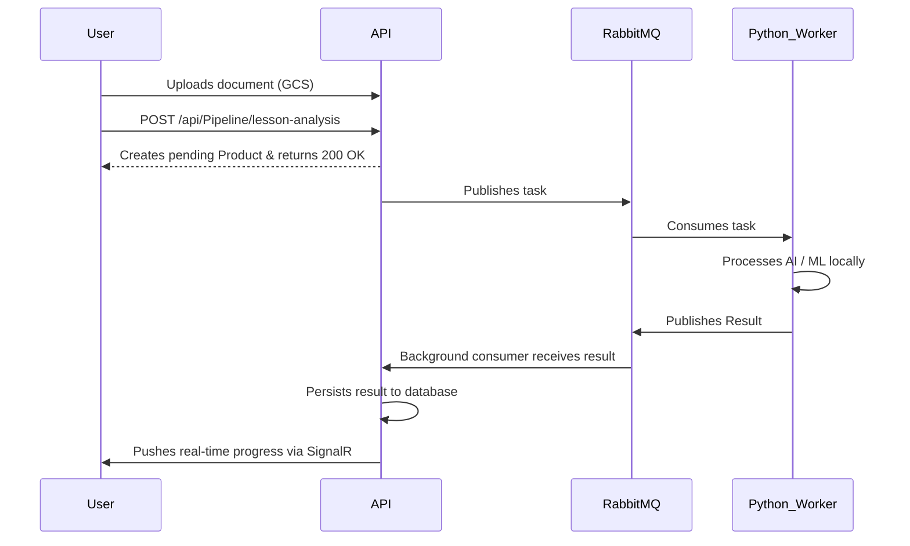

# 🎓 EduVi Backend (SEP490_BE)

[](https://dotnet.microsoft.com/)
[](#)
[](https://www.docker.com/)
[](#)

> The core .NET 8 Web API for the **EduVi** education platform. Features include an asynchronous AI pipeline for lesson analysis, slide generation, video generation, and game creation.

---

> **⚠️ Deployment Guide Available!**
> Trying to push this to the cloud or set up the full VM infrastructure? Please read our comprehensive **[Deployment Guide](DEPLOYMENT_GUIDE.md)** for instructions on architecture, GCP Configuration, CI/CD Actions, and securely accessing internal queues.

---

## 📑 Table of Contents

- [Overview](#overview)
- [Architecture](#architecture)
- [Tech Stack](#tech-stack)
- [Project Structure](#project-structure)
- [Features & API Modules](#features--api-modules)
- [AI Pipeline Flow](#ai-pipeline-flow)
- [Getting Started](#getting-started)
  - [Prerequisites](#prerequisites)
  - [Environment Configuration](#environment-configuration)
  - [Running Locally](#running-locally)
  - [Running with Docker](#running-with-docker)
- [Development Guidelines](#development-guidelines)

---

## 🚀 Overview

The **EduVi Backend** is designed to provide robust, scalable, and responsive RESTful APIs along with real-time updates via SignalR. 
It heavily relies on background processing, caching, and message queues to manage complex AI generation tasks (slides, videos, and game content) asynchronously without blocking the user interface.

---

## 🏛️ Architecture

The solution uses a clean, layered architectural approach:

```text
EduVi.WebAPI          -> Controllers, Middleware, SignalR Hubs, BackgroundServices
EduVi.Services        -> Core Business logic (accessed via DI interfaces)
EduVi.Repositories    -> Data access via EF Core, Unit of Work pattern
EduVi.Contracts       -> DTOs, shared constants, API response wrappers
```

**Key Layering Rules:**
- **Controllers** handle HTTP concerns only and delegate work to Services.
- **Services** encapsulate business logic and access data repositories exclusively through `IUnitOfWork`.
- **Repositories** manage data access and EF Core queries.
- External APIs communicate using unique **Code fields** (e.g., `SubjectCode`, `LessonCode`) rather than internal database standard integer IDs.

---

## 🛠️ Tech Stack

| Component | Technology |
|---|---|
| **Framework** | .NET 8, ASP.NET Core Web API |
| **Database** | SQL Server (Entity Framework Core) |
| **Cache / Session** | Redis (StackExchange.Redis) |
| **Message Queue** | RabbitMQ |
| **Real-time** | SignalR (with Redis backplane) |
| **File Storage** | Google Cloud Storage (GCS) |
| **Authentication**| JWT Bearer tokens |
| **Payments** | PayOS |

---

## 📁 Project Structure

```text
SEP490_BE/
├── EduVi.Contracts/      # DTOs, Enums, and Shared Constants
├── EduVi.Repositories/   # DbContext, Repositories, Unit of Work
├── EduVi.Services/       # Business Logic, Email, Hub logic, external API integrations
├── EduVi.WebAPI/         # API Controllers, Middlewares, SignalR Hubs, Program.cs
├── nginx/                # Reverse proxy config for containerized environment
├── private/              # Hidden GCP keys and local secrets
├── tests/                # Unit and Integration test projects
└── docker-compose.yml    # Root Docker Compose for quick spin-up
```

---

## ⚙️ Features & API Modules

| Module / Scope | Description |
|---|---|
| **Auth** | Registration, login, OTP validation, JWT issuance, Google OAuth |
| **Admin** | Dashboard, user management, financial analysis, system configs |
| **Curriculum** | Subjects, Grades, Lessons, Textbook and Curriculum data ingestion |
| **Projects & Classes** | Teacher's project flow, student lists, tasks |
| **AI Generation** | Input document upload, digital content generation (Slides, Videos, Games) |
| **Marketplace** | Material marketplace, browsing products, transactions |
| **Payments** | Internal wallet, PayOS top-up, subscriptions, expert payout withdrawals |
| **Profiles** | Expert, Teacher, and Staff profile management and verification |

---

## 🔄 AI Pipeline Flow

The backend communicates with Python AI microservices via RabbitMQ to process massive document and video generation workloads.



### SignalR Hub Configuration

- **Endpoint**: `/hubs/pipeline`
- **Event**: `PipelineProgress`
- **Group Model**: `user_{userId}`
- **Test Page**: `http://localhost:5202/signalr-test.html`

### Asynchronous State Machines

**Product Status:**
`0: New` ➜ `1: Processing` ➜ `2: Evaluated` ➜ `4: GeneratingSlides` ➜ `5: SlidesGenerated` (Error states: 3, 6)

**Video Status:**
`0: Queued` ➜ `1: Completed` (Error state: 2)

---

## 💻 Getting Started

### Prerequisites

- [.NET 8 SDK](https://dotnet.microsoft.com/download/dotnet/8.0)
- SQL Server (Developer or Express)
- Redis Server
- RabbitMQ
- GCP Service Account Key (`private/gcp-key.json`) for Cloud Storage

### Environment Configuration

In `EduVi.WebAPI/`, configure your `appsettings.Development.json` (or `appsettings.json`):

```json
{
  "ConnectionStrings": {
    "DefaultConnection": "<sql-server-connection-string>",
    "RedisConnection": "<redis-connection-string>"
  },
  "Jwt": {
    "SecretKey": "<your-secret>",
    "Issuer": "<issuer>",
    "Audience": "<audience>"
  },
  "RabbitMQ": {
    "HostName": "localhost",
    "Port": 5672,
    "UserName": "guest",
    "Password": "guest",
    "VirtualHost": "/"
  },
  "GCS": {
    "BucketName": "<your-gcs-bucket>"
  },
  "PayOS": {
    "ClientId": "<your-client-id>",
    "ApiKey": "<your-api-key>",
    "ChecksumKey": "<your-checksum-key>"
  }
}
```
**Important:** Ensure you place your GCP service account JSON key in the path: `private/gcp-key.json`.

---

### Running Locally

1. **Restore dependencies and build the solution:**
   ```bash
   dotnet build SEP490_BE.slnx
   ```
2. **Apply Database Migrations** (if any pending):
   ```bash
   dotnet ef database update --project EduVi.Repositories --startup-project EduVi.WebAPI
   ```
3. **Run the API:**
   ```bash
   dotnet run --project EduVi.WebAPI/EduVi.WebAPI.csproj
   ```

**Access Endpoints:**
- Swagger UI: [http://localhost:5202/swagger](http://localhost:5202/swagger)
- API LocalHost HTTPS: [https://localhost:7191](https://localhost:7191)

---

### Running with Docker

You can spin up the entire API, alongside database, Redis, and RabbitMQ via standard Docker Compose.

```bash
docker-compose up --build -d
```

---

## 📖 Development Guidelines

### Notes on Standards
- **Localization**: UI-facing failure responses are localized to **Vietnamese** by default.
- **Validation**: Model validation responses are standardized in `Program.cs` to prevent default ASP.NET English errors. Customize via DTO annotations in the `EduVi.Contracts` project.

### Quick Onboarding Checklist
1. **Program.cs** (`EduVi.WebAPI`): Understand dependency injection registrations, middleware, and CORS policies.
2. **Controllers**: Start from a feature controller (e.g., `PipelineController` or `AuthController`).
3. **Services** (`EduVi.Services`): Map controllers to their respective services to investigate the business logic.
4. **Repositories implementation**: Understand the generic/custom repositories acting behind the `UnitOfWork` abstraction.
5. **DTOs** (`EduVi.Contracts`): Always verify existing standard response wrappers before altering endpoint returns.

---

*Project Maintained by the SEP490 Capstone Team - 2026.*